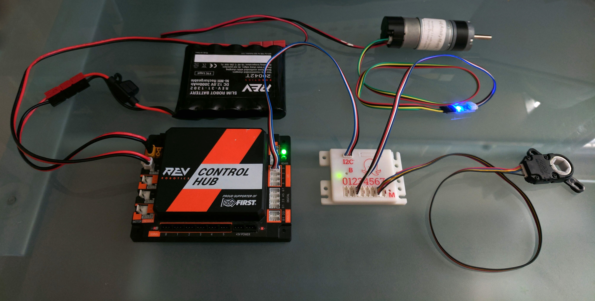
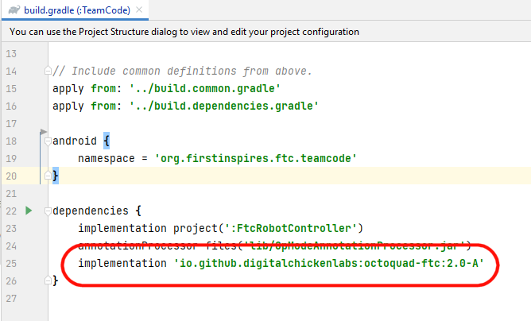
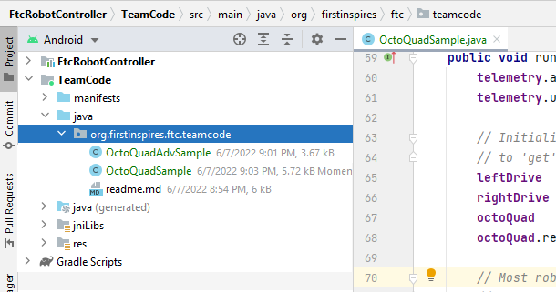
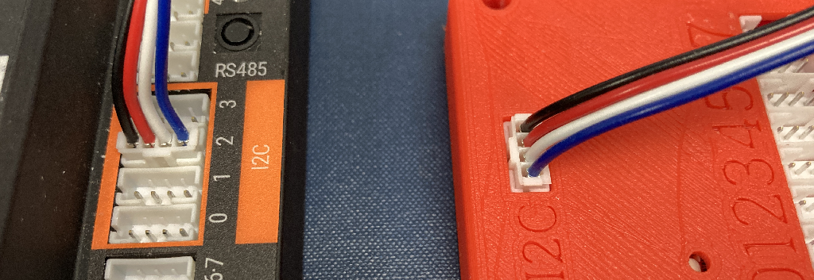
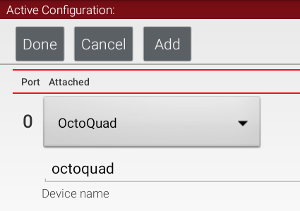
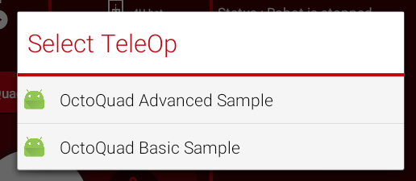
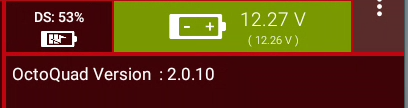
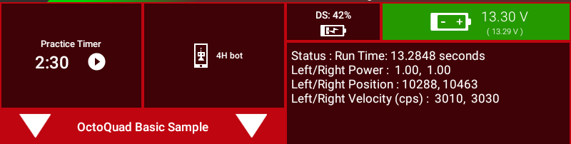
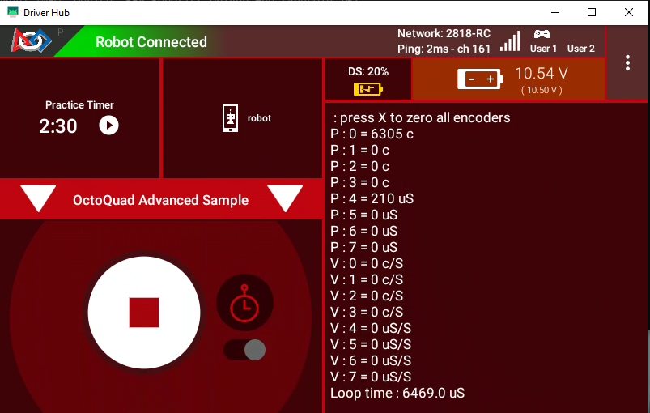
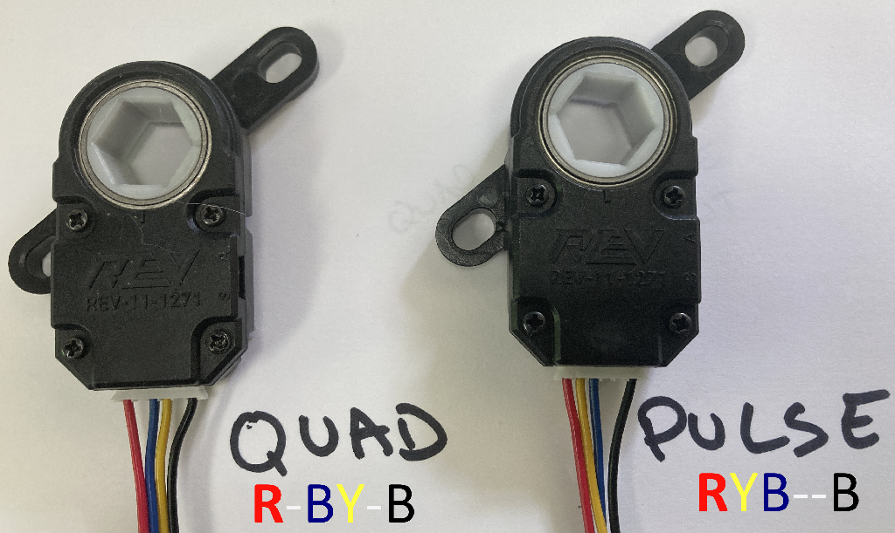

# **OctoQuad: For Android Studio**

If you develop with Android Studio, this section of the evaluation guide is for you.  If you use Blocks or OnBotJava, go to the [BlocksJava](/BlocksJava/) folder.

*An OctoQuad connected to a REV Control Hub with a quadrature encoder and absolute encoder attached*

## **Overview**

To evaluate the OctoQuad using Android Studio, you simply need to add the  OctoQuad.java I2C Driver class to your RobotController project, and all the OctoQuad driver methods will be available to your OpModes.

In addition to the [basic sample](OctoQuadSample.java) OpMode provided here, there is also a more [advanced sample](OctoQuadAdvSample.java) that illustrates selecting the high speed I2C mode for lower latency, how to read an Absolute Position encoder and how to display both position and velocity information for all encoders.

### Step 1: Adding the OctoQuad to an Android Studio project.

The simplest way to try out the OctoQuad with these OpModes is to add the external OctoQuad driver to your project as a dependency.    To do this, edit the TeamCode build.gradle file and add the following line into the dependencies section as shown below:

`implementation 'io.github.digitalchickenlabs:octoquad-ftc:2.0-A'`

Next you need to add the two samples to your project.  Use the links below to locate the files, and copy them to the TeamCode folder of your FTC project.

- The basic OpMode: [OctoQuadSample.java](OctoQuadSample.java) 

- The advanced OpMode:  [OctoQuadAdvSample.java](OctoQuadAdvSample.java)

Once you have copied these files to your teamcode folder, it will look like this.

 

You should now be able to build and deploy the project.   Once this is done, the OctoQuad will be available as a **device** on the Robot Configuration I2C list.

### **Step 2: Configuring the Hardware**

The Control Hub and Expansion Hub both have four I2C ports available for connecting to sensors. 

- Use a standard 4-wire sensor cable and connect one end to the I2C port on the OctoQuad.  This port is all by itself on one side of the board.  Plug the other end of the cable into I2C **port 2** on the Controller Hub or Expansion Hub.  Note that the cable is keyed, so the plug will only go in one way.  Any of the four I2C ports will work, but port 2 is used explicitly in the advanced sample here.
  
  

Now that the OctoQuad driver and hardware are installed, you can go to the Configure Robot screen on either the RC or DS and add the physical device to your active configuration.

*NOTE: If you intend to use any of the sample OpModes provided here, your Robot Configuration should also contain two drive motors called "left_drive" and "right_drive".    Most samples also use these two motor names*.

- Open an existing Robot Configuration or start a new one.

- Navigate down to the page where I2C Bus 0-3 are displayed.

- Click on I2C Bus 2, click the **Add** button at the top.  A pulldown will appear.

- Click the pulldown, scroll down and select: OctoQuad.  

- In the **Device name** field, enter "octoquad" with no capital letters.
  
  
  
  Click **Done** repeatedly until the **Save** button appears.  Click **Save** and then name your configuration.  

### Step 3: Running the samples

Pulling up the TeleOp OpMode menu will show the two sample OpModes.

In INIT, both of these program will display the OctoQuad firmware revisions

When you press PLAY on the **Basic Sample**, it will enter a typical TeleOp driving mode and it will display drive motor power, position and velocity.  You can use the two joysticks to drive in tank mode.

When you press play on the **Advanced Sample** it will display position and velocity (counts per 50mSec sample) for all 8 encoder inputs.  You can plug the motor encoders into any of these inputs on the OctoQuad.

Initially all motors will drive in their normal forward rotation direction.  But to reverse the left motor, you can press the DPad Down button.  This will reverse both the motor and the encoder, so power and encoder will still read positive but now the robot can drive forward.

Pressing the X button will also reset all encoders to zero.

Please note the loop cycle time at the bottom of the screen.  The switch to 400Hz I2C enables two motors to be set, and all 8 encoders to be read (pos. and vel.) in a less-than 7 mSec loop.

### Options: Reading an Absolute Position Encoder

An absolute encoder is one that ouputs a signal to indicate the position of the encoder within a fixed 360 Degree rotation.  There are various ways that this position can be encoded, but one popular way is to use a variable Pulse Width digital signal.  The width of the output pulse (in micro seconds) corrosponds to the 0-360 degree range. 

In addition to reading quadrature encodered signals, the OctoQuad can also perform Pulse Width timing to determine absolute positions, and if it's told the valid range of the pulse width, it can also determine rotational velocity.

The 8 OctoQuad inputs are configured as two banks of 4.  Each bank can either read 4 Quad Encoders or 4 Pulse Width encoders.  This configuration can be set using a command trough the I2C interface (and saved in FLASH if desired).  This is demonstrated in the [advanced sample](OctoQuadAdvSample.java) sample.

To test out this capability, you can use the The RevRobotics "Through Bore Encoder"" (TBE) ([Through Bore Encoder - REV Robotics](https://www.revrobotics.com/rev-11-1271/)). It is one example of an absolute encoder that can generate a pulse width putput.  

To run the REV TBE in Absolute Position mode, you will need to move one wire on the standard cable.  The image below shows this encoder wired for normal Quad signals (left) and Absolute Quad signal (right).  Essentialy the yellow pin is extracted and moved to the other side of the blue wire.

In the Advanced Sample there is a block of code which can be used to put the second set of encoder inputs (4-7) into Absolute mode.  If you modify the cable on a REV TBE, and then plug it into an input port (4-7), the sample program will display the pulse width in micro seconds.  

Since the REV TBE outputs a pulse width from 1 to 1025 uS over the range of 0-360 degrees a user program could convert the pulse width to position, using this formula:  Angle in degrees = (PulseWidth - 1) * 360 / 1024

*Updated: 8/30/2022
