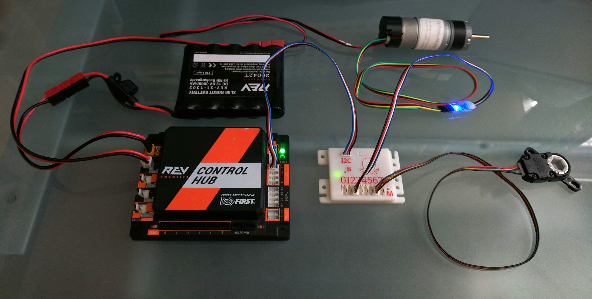
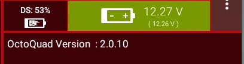

# **OctoQuad: For Blocks or OnBotJava**

If you develop with Blocks or OnBotJava, this section of the evaluation guide is for you.   If you use Android Studio, go to the [AS Java](/ASJava/) folder.

*An OctoQuad connected to a REV Control Hub with a quadrature encoder and absolute encoder attached*

## **Overview**

An external library has been created to work with both Blocks and OnBotJava in a similar way. The library must be transferred  to the Robot Controller using the standard OnBotJava upload feature.  

Once built, the OctoQuad driver is then available for Blocks and OnBotJava programs to use.  An OctoQuad module can then be added to an I2C port on the Control Hub or Expansion Hub.

*Note: Steps 1 and 2 are the same for both Blocks and OnBotJava.  Only step 3 is different. So, below there is **Step 3A for Blocks** and **Step 3B for OnBotJava**.*

In addition to the external library, two sample OpModes are also provided.  One is for Blocks and one is for OnBotJava.  These may be uploaded in the standard way for each platform.  These examples assume a configured OctoQuad device name of "octoquad".

*Note: This external Library feature only works with RC app version 7.0 and higher.*

### **Step 1:  Upload and install the OctoQuad Library**

The OctoQuad library is an AAR file (**octoquad-ftc-x.y-Z.aar**) where x and y are the mayor and monor version numbers, and Z is the engineering release letter.  The latest file is  [located here](https://repo1.maven.org/maven2/io/github/digitalchickenlabs/octoquad-ftc/2.0-A/octoquad-ftc-2.0-A.aar) in a Maven repository.  Download this file to your PC, and then connect to the robot controller as if you were going to program in Blocks or OnBotJava.

Once you are connected, click on the OnBotJava link at the top of the page.

Once there, click on the **upload files** icon (Up arrow) to begin a transfer.

<mark>You will be prompted for a *.java, *.jar or *.aar file.  Locate, and **double click** on the library file (**octoquad-ftc-x.y-z.aar**) you just download.  </mark>

A popup will appear letting you know the upload is being processed.  Wait until a close button appears, and then click it.

Once loading is complete, there will be a new item in the project files tree,, The name will match the version of the driver you uploaded. 

To complete the installation process, you must click the "Build Everything" icon (wrench) and look for the "Build SUCCESSFULL" message.

**Since this library DOES contain a hardware device class, you must now restart the Robot Controller for the OctoQuad to be added into the hardware map.**

### **Step 2: Configuring the Hardware**

The Control Hub and Expansion Hub both have four I2C ports available for connecting to sensors. 

- Use a standard 4-wire sensor cable and connect one end to the I2C port on the OctoQuad.  This port is all by itself on one side of the board.  Plug the other end of the cable into I2C **port 2** on the Controller Hub or Expansion Hub.  Note that the cable is keyed, so the plug will only go in one way.  Any of the four I2C ports will work, but port 2 is used explicitly in some of the samples here.
  
  

Now that the OctoQuad driver and hardware are installed, you can go to the Configure Robot screen on either the RC or DS and add the physical device to your active configuration.

*NOTE: If you intend to use any of the sample opmodes provided here, your Robot Configuration should also contain two drive motors called "left_drive" and "right_drive".    Most samples also use these two motor names*.

- Open an existing Robot Configuration or start a new one.

- Navigate down to the page where I2C Bus 0-3 are displayed.

- Click on I2C Bus 2, click the **Add** button at the top.  A pulldown will appear.

- Click the pulldown, scroll down and select: OctoQuad.  

- In the **Device name** field, enter "octoquad" with no capital letters.
  
  

- Click **Done** repeatedly until the **Save** button appears.  Click **Save** and then name your configuration.  

You are now ready to upload an OpMode to test the OctoQuad.

### **Step 3A: Uploading a <u>Blocks</u> sample OpMode.**

A sample Blocks OpMode is included [here](OctoQuadSample.blk) (OctoQuadSample.blk).  This example adds OctoQuad encoders to the standard **Basic Tank Drive** OpMode.  Download this file to your PC, and then connect to the robot controller and navigate to the Blocks screen.

Click on **Upload OpMode**, then **Choose File** and select the sample you just downloaded.

Click on **OK** to complete the upload. This will load the sample and take you directly to that OpMode.  

Note that the OctoQuad blocks are yellow, and there is an **OctoQuad** item under **Additional Hardware** in the Blocks palette.

You may now **Save** this OpMode and run it form the Driver Station, remembering the following:

- There should be two motors in your Active Configuration called **left_drive** and **right_drive.**

- There should be an OctoQuad device in your Active Configuration called **octoquad**.

- To read your encoders, you must run encoder cables from your two motors to ports 0 and 1 on the OctoQuad module.  This will match the sample OpMode **getPosition** blocks.

### Running the OpMode

With everything connected, start the OctoQuadSample OpMode.  On initialization, the telemetry screen should report the OctoQuad firmware revision. 

Once you hit Play, the screen will display the motor powers and Encoder positions.  Use Gamepad 1 left and right joysticks (tank mode) to run the motors and see the encoder positions change.

Feel free to explore the OctoQuad sample further.  Use the Blue question marks to get a more detailed explanation of each block.  There are also more OctoQuad blocks in the palette.  Of particular interest is the ability to display an encoder's rotational velocity in counts per "sample interval".

### **Step 3B: Uploading an <u>OnBotJava</u> sample OpMode.**

A sample OnBotJava OpMode is included [here](OctoQuadSample.java) (OctoQuadSample.java). This example adds OctoQuad encoders to the standard **Basic Tank Drive** OpMode. Download this file to your PC, and then connect to the robot controller and navigate to the OnBotJava screen.

<mark>Use the **Upload Files** button and select the **OctoQuadSample.java** file to upload.</mark>

Once the upload is complete, the OctoQuadSample should be in the Project Files tree along with the library.

You can now click the **Build Everything** button (wrench) to add the OpMode to the Robot Controller.  After a successful build,  select the OctoQuadSample OpMode from the TeleOp. OpMode list and run it.

When you first INIT the OpMode it will display the OctoQuad firmware revision.  

Then with you press Play it will display the Motor powers and positions.  Use gamepad 1 joysticks to run the motors.

*Updated: 8/30/2022
