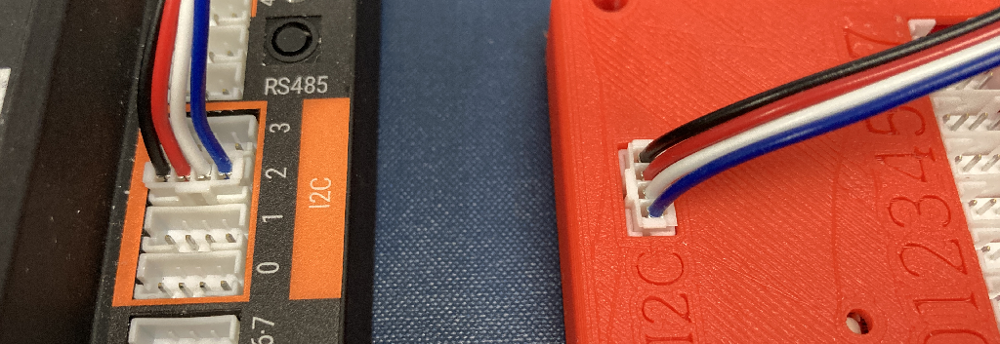

# **OctoQuad: FTC Evaluation Guide**

This guide was created to demonstrate integrating the OctoQuad with FTC OpModes.  

*An OctoQuad connected to a REV Control Hub with a quadrature encoder and absolute encoder attached*

## **Overview**

The OctoQuad is an 8 channel Quadrature/Absolute Encoder input device.  It essentially concentrates up to 8 encoders into one data stream that can be read via I2C, SPI, Serial or USB.  

Its primary interfaces are designed to be compatible with typical FTC mechanical,  electrical and software interfaces.  

In addition to providing encoder position, the OctoQuad also provides encoder velocity with a selectable measurement interval.   A [full datasheet](https://github.com/DigitalChickenLabs/OctoQuad/tree/master/documentation) is available. 

The OctoQuad may be evaluated using any of the three standard FTC programming methods: 

- Blocks 

- OnBotJava

- Android Studio Java  

Each method is described below, and all referenced code can be within this repository.

### **Blocks and OnBotJava** [go now!](/BlocksJava/)

An external library has been created to work with both Blocks and OnBotJava in a similar way.  The library is transferred  to the Robot Controller using the standard OnBotJava upload feature.  Once built, the OctoQuad driver is available for Blocks or OnBotJava programs to use, and an OctoQuad can be added to an I2C port on the Control Hub or Expansion Hub.

In addition to the external library, two sample OpModes are also provided.  One is for Blocks and one is for OnBotJava.  These may be uploaded in the standard way for each platform.  These examples assume a configured OctoQuad device named "octoquad".

To step through the upload procedure and sample OpModes, visit the  [Blocks Java](/BlocksJava/) folder.

### **Android Studio Java** [go now!](/ASJava/)

To evaluate the OctoQuad using Android Studio, you can simply add a dependancy to the external library, OR if you want to access the underlying code, you can add the source files to your project, and all the driver methods will be available to your OpModes.

A more fully featured sample program is also provided for Android Studio.  This sample illustrates selecting the high speed I2C mode for lower latency, and reading pulse width Absolute Position encoders like the REV Trhough Bore Encoder.

To review the driver and sample OpMode, visit the [Android Studio Java](/ASJava/) folder.

### How do hook up the OctoQuad?

Use a standard 4-wire sensor cable and connect one end to the I2C port on the OctoQuad.  This port is all by itself on one side of the board.  Plug the other end of the cable into any available I2C port on the Controller Hub or Expansion Hub.  Note that the cable is keyed, so the plug will only go in one way.  

### How do I know if my OctoQuad is working?

The small yellow status LED is your friend.  It shines through a thin portion of the cover right next to the small hole.  

Here's what it shows:

#### At Power-Up

When the OctoQuad is first powered on, the LED will repeatedly display a blink sequnce. This indicates that the OctoQuad is ready to receive communications. The number of blinks corresponds to the active interface:

| Number of Blinks | Interface |
| ---------------- | --------- |
| 1 (default)      | I2C       |
| 2                | SPI       |
| 3                | UART      |
| 4                | USB       |

The OctoQuad will continue to display the interface bink sequence until traffic occurs on the active interface.   Once traffic occurs it will switch to displaying the link activity. 

#### All other times (link activity)

The LED will blink rapidly (7Hz) if there is currently in-flight traffic on the active interface, or if there has been traffic on the active interface within the past 1000ms.

The LED will blink slowly (1Hz) if there has been traffic on the active interface since power-up, but there has not been any traffic within the past 1000ms

*Updated: 8/30/2022*
